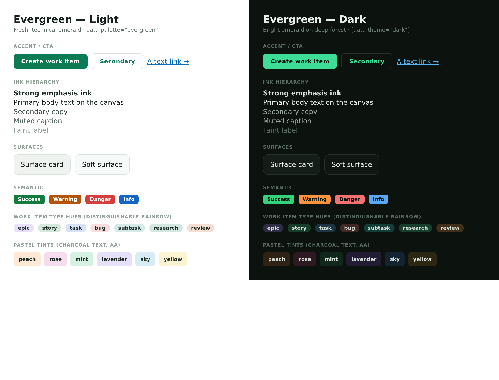

# Palette — Evergreen (`data-palette="evergreen"`)

> A fresh, technical **emerald** colour scheme. Registered in
> [`lib/theme/palettes.ts`](../../lib/theme/palettes.ts); its overrides live in
> the `[data-palette='evergreen']` (light) and
> `[data-palette='evergreen'][data-theme='dark']` (dark) blocks of
> [`app/globals.css`](../../app/globals.css).

**Tagline:** Fresh and technical — an emerald primary over cooled forest
neutrals, a green-leaning UI.
**Inspiration:** [getdesign.md](https://getdesign.md/) — Supabase (dark
emerald), Spotify (vibrant green), MongoDB (spring green). The accent hue is
anchored to those brands' emerald/green and the light/dark ramps + UI-state
steps are built from Radix Colors (green / jade), the AA-first 12-step scale.

This is the COLOUR (palette) axis only. Shape/feel is the independent
`data-style` axis — picking this palette never changes a radius. `data-theme`
(`light` | `dark`) is the base _within_ a palette. See
[`DESIGN.md`](../DESIGN.md) §2 for the full colour system and the two-axis
contract.

## How it re-skins (the mechanism)

Every Tier-3 `--el-*` element token references a Tier-0 `--color-*` value, so
Evergreen re-skins by **overriding the `--color-*` layer** in its
`[data-palette]` blocks. That single override cascades a **coordinated** re-skin
through every surface, ink step, accent/CTA, link, semantic colour, pastel tint,
work-item-type hue, and chart colour at once — no per-`--el-*` enumeration and no
risk of drifting out of sync with the element layer. A `[data-palette]` block
overrides **only** colour (`--color-*` / `--el-*`), **never** a shape/feel token
(radius / spacing / shadow / sizing / motion / type) — that is the independent
`data-style` axis, and the `paletteRegistry.test.ts` disjointness guard enforces
it. The two concrete-hex `--el-*` tokens that do not resolve through `--color-*`
(`--el-sidebar-item-bg-hover`) are re-skinned explicitly.

The work-item **type** hues and categorical **chart** colours stay a
distinguishable rainbow — a `code` chip still reads distinct from a `test` chip;
only the palette's overall MOOD shifts emerald. Violet replaces the house pink as
the complementary accent (epic / design / highlight) so those chips stay distinct
from the emerald greens.

## Colour roles (the `--el-*` element-token layer)

| Role group          | Evergreen (light)                                                                                                                                                       |
| ------------------- | ----------------------------------------------------------------------------------------------------------------------------------------------------------------------- |
| Text scale          | cooled forest-charcoal ink hierarchy — `--el-text` `#14201b` → `-secondary` `#42534a` → `-faint`                                                                        |
| Accent (CTA)        | emerald — `--el-accent` fill `#0c7a52` (white label) + `--el-accent-on-surface` `#0c7a52`                                                                               |
| Highlight           | violet `#8257e6` — `--el-highlight` (decorative; epic / design type hue)                                                                                                |
| Surfaces            | cooled green-grey over a white canvas — `--el-surface` `#eef3f0`, `--el-surface-soft` `#f6faf8`                                                                         |
| Recessed canvas     | planning board — recessed below the page and `--el-surface` — `--el-canvas` `#e4ebe7` (dark `#080d0a`)                                                                  |
| Borders             | cool hairlines — `--el-border` `#d9e2dc`, `-soft`, `-strong`                                                                                                            |
| Links               | blue affordance — `--el-link` `#0a6ebd` / `--el-link-pressed` `#08537f`                                                                                                 |
| Semantic            | `--el-success` `#127c3e` (grassy) · `--el-warning` `#b45309` · `--el-danger` `#d63d3d` · `--el-info` `#1366c4`                                                          |
| Status ramp         | `--el-status-in-review` set directly — Radix Jade 12 `#1d3b31` → `#adf0d4`; `--el-status-cancelled` → slate `#9aaaa1` in dark — see below                               |
| Pastel tints        | cool/green-leaning washes — `--el-tint-{peach,rose,mint,lavender,sky,yellow}`                                                                                           |
| Work-item type hues | distinguishable rainbow via `--el-type-*` (emerald research, grass story/test, blue task/code, teal subtask/content, violet epic/design, red bug/deploy, orange review) |

## Token mapping

`[data-palette='evergreen']` sets the **light** values above; the companion
`[data-palette='evergreen'][data-theme='dark']` block sets the **dark** values —
a bright emerald primary (`#3ddc97`) carrying dark label text (Supabase-style)
over a deep-forest canvas (`#0c130f`), with the cooled neutrals, tints, and
semantic hues brightened for the dark base. Both blocks override only colour
tokens.

### The status ramp — why `in_review` and `cancelled` are set directly

Two collisions, both found by the perceptual sweep in MOTIR-2075:

- **`in_review` vs `done`.** `--el-status-in-review` rides `--color-primary`
  (emerald `#0c7a52` → `#3ddc97`) and `--el-status-done` rides `--color-success`
  (grass `#127c3e` → `#34d27a`) — two greens **ΔE2000 5.5** apart in light and
  **4.7** in dark. This document previously claimed they "read apart"; measured,
  they do not. The **status ramp takes its own step of the palette's jade** —
  **Radix Jade 12**, deep in light (`#1d3b31`) and pale in dark (`#adf0d4`), the
  same light/dark inversion Graphite's accent step uses. Separation **ΔE 19.2 /
  17.2**; contrast **10.9:1 / 13.3:1** on `--el-surface`.
- **`todo` vs `cancelled` (dark).** `--color-stone` `#5a6b62` against
  `--color-steel` `#6f8077` is **ΔE 8.3** — this palette's neutral ramp is
  compressed against the base's, which keeps the pair ~12 apart. `cancelled`
  takes the palette's own next step up, `--color-slate` `#9aaaa1` (**ΔE 22.4**,
  contrast 7.1:1). Light needs no change and re-asserts `var(--color-steel)`.

Every override is declared in BOTH themes even where one needs no change: a
palette's light block and the base `[data-theme='dark']` block tie on
specificity and the palette block comes later in the sheet, so an unpaired light
override would leak onto the dark canvas.
`tests/theme/statusHueSeparation.test.ts` enforces the pairing.

## Accessibility

Every text-on-surface, CTA, link, and chip pairing passes **WCAG AA** (≥4.5:1
for text; ≥3:1 for large/UI) in **both** light and dark — verified by rendering
the token specimen, not by eye (the `--el-*` AA + design-mockup render
checklist). Highlights: emerald CTA white-on-`#0c7a52` = 5.36:1; emerald accent
text `#0c7a52` on white = 5.36:1; link `#0a6ebd` on the soft hovered-row surface
= 5.01:1; and in dark, bright-emerald text `#3ddc97` on the forest canvas =
10.65:1 with dark label text on the emerald fill = 10.67:1.
