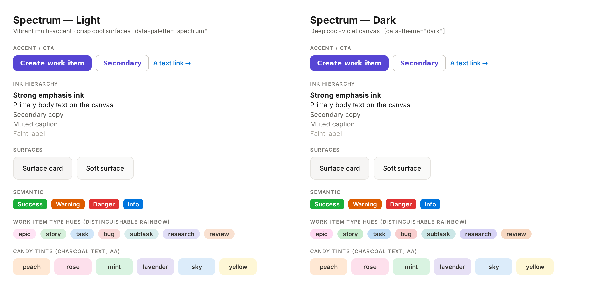

# Palette — Spectrum (`data-palette="spectrum"`)

> A vibrant, playful, energetic **multi-accent** re-skin. Registered in
> [`lib/theme/palettes.ts`](../../lib/theme/palettes.ts); its override lives in
> the **AXIS 1 (COLOUR)** section of
> [`app/globals.css`](../../app/globals.css) as the `[data-palette='spectrum']`
> block (light) + a `[data-palette='spectrum'][data-theme='dark']` companion.

**Tagline:** Vibrant and playful — crisp cool surfaces, a bright violet primary,
a candy-bright multi-hue accent & tint set.
**Inspiration:** Figma's vibrant multi-colour brand and Airtable's colourful,
friendly palette (getdesign.md), mapped onto Motir's `--el-*` roles; the actual
light/dark ramps and UI-state steps are drawn from **Radix Colors** (Violet /
Iris / Pink / Blue / Jade / Amber / Red) — the accessibility-first 12-step
scales designed for UI states.

This is the COLOUR (palette) axis only. Shape/feel is the independent
`data-style` axis — picking Spectrum never changes a radius. `data-theme`
(`light` | `dark`) is the base _within_ the palette. See
[`DESIGN.md`](../DESIGN.md) §2 for the full colour system and the two-axis
contract.

Spectrum is **visibly distinct from Motir**, not just an accent-hue swap: the
surfaces move from warm cream to crisp cool-white (with a faint violet cast),
the muted Notion pastels become a saturated candy-bright rainbow, and a vivid
magenta-pink replaces the warm brand pink — a coordinated re-skin of surfaces,
ink, accent, semantic, and tints.

## How it re-skins (token mapping)

Every Tier-3 `--el-*` element token references a Tier-0 `--color-*` source
var. So — exactly like the `[data-theme='dark']` block — Spectrum re-skins by
overriding the **`--color-*` source**, and the whole `--el-*` layer (surfaces,
ink, accent, links, semantic, pastel tints, work-item type hues, charts) follows
coherently with no per-token churn. The only `--el-*` token overridden directly
is `--el-sidebar-item-bg-hover` — a concrete hex in Tier 3, not a `--color-*`
reference.

The block overrides **only colour tokens** (`--color-*` / `--el-*`) — never a
shape/feel token (`--radius-*` / `--spacing-*` / `--shadow-*` / `--height-*` /
`--transition-*`). That disjointness — colour here, shape on the `data-style`
axis — is what makes "style × palette" a product of two independent choices, and
`tests/theme/paletteRegistry.test.ts` enforces it.

## Colour roles (the `--el-*` element-token layer)

| Role group          | Spectrum (light → dark)                                                                                              |
| ------------------- | -------------------------------------------------------------------------------------------------------------------- |
| Text scale          | cool violet-neutral ink hierarchy — ink `#1a1626` → `#ece9f6`; secondary `#524d66` → `#aaa3c2`                       |
| Accent (CTA)        | bright violet — on-surface `#6440d6` → `#a78bfa`; fill `#5a37c9` → `#6d4fd6`; candy magenta-pink `--el-highlight`    |
| Surfaces            | crisp cool-white over violet-tinted sections — `#f4f2fb` / `#faf9fe` → violet-navy `#14111f` / `#1d1830` / `#181426` |
| Borders             | cool violet hairlines — `#e6e2f3` → `#2b2440`                                                                        |
| Links               | clean vivid blue, distinct from the violet primary — `#2563eb` → `#8fb8ff`                                           |
| Semantic            | danger `#d92e2b`/`#f0555f` · success `#16a34a`/`#36c977` · warning `#ea580c`/`#fb8b4c` · info `#2563eb`              |
| Pastel tints        | candy-bright feature washes — `--el-tint-{peach,rose,mint,lavender,sky,yellow}` (a saturated, well-separated set)    |
| Work-item type hues | re-skin automatically via the `--color-*` they map to — code/research read violet/blue, design/epic read magenta     |

## Accessibility

Every text-on-surface, white-on-fill, link, and chip-tint pairing clears **WCAG
AA** (≥4.5; ≥3.0 for icon/UI hues) in **both** light and dark — verified
numerically and by a rendered specimen, never eyeballed (the `--el-*` AA +
design-mockup render checklist). Notable margins:

- Primary ink on canvas — **17.7:1** (light) / **15.5:1** (dark).
- Secondary `--el-text-secondary` on surface — **~6.5:1** / **~7.0:1**.
- Captions `--el-text-muted` on the soft surface a hovered row paints —
  **~6.6:1** / **~7.1:1**.
- Violet `--el-accent-on-surface` on a surface — **6.5:1** / **6.5:1**; white on
  the `--el-accent` fill — **7.4:1** / **5.6:1**.
- Link on a page surface — **5.2:1** / **9.2:1**.
- White on the danger fill — **~4.7:1** (light); danger reads AS text on the
  dark canvas — **~5.5:1**.
- `--el-text-strong` on every candy tint — **≥10.9:1** both themes.
