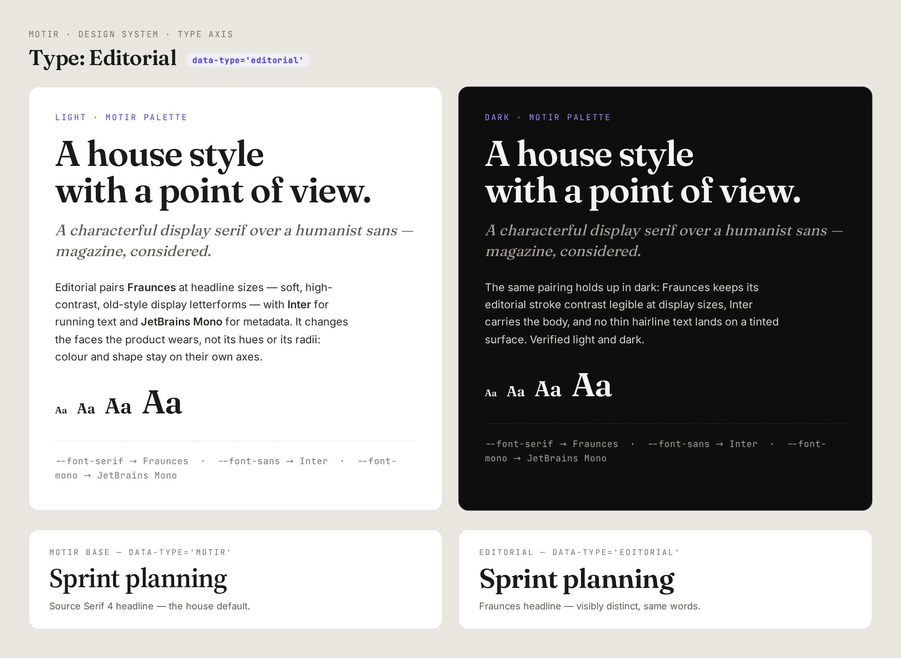

# Type — Editorial (`data-type="editorial"`)

> A new-face pairing registered in
> [`lib/theme/typography.ts`](../../lib/theme/typography.ts); its
> `[data-type='editorial']` block lives in
> [`app/globals.css`](../../app/globals.css). Unlike the base-face pairings
> (`motir` / `motir-sans` / `motir-mono`), it **adds one new face — Fraunces** —
> loaded via next/font in [`app/layout.tsx`](../../app/layout.tsx).

**Tagline:** A characterful display serif over a humanist sans — magazine, considered.
**Faces:** Fraunces display headlines · Inter body · JetBrains Mono meta.



This is the TYPE (`data-type`) axis only — the third design axis. Colour
(`data-palette`) and shape (`data-style`) are independent: picking Editorial
never changes a hue or a radius. See [`DESIGN.md`](../DESIGN.md) for the
three-axis contract.

## Role mapping (the `--font-*` tokens)

| Role              | `--font-*` token | Editorial face                             |
| ----------------- | ---------------- | ------------------------------------------ |
| Headlines (xl+)   | `--font-serif`   | **Fraunces** (high-contrast display serif) |
| Body / UI         | `--font-sans`    | Inter (the base humanist sans — unchanged) |
| Meta / code / IDs | `--font-mono`    | JetBrains Mono (unchanged)                 |

Only the headline (serif) role is re-pointed; body and mono keep the base
roles. That is the whole pairing: a real, visible **face** swap — Motir's
neutral Source Serif 4 headlines become Fraunces' soft, high-contrast,
old-style display letterforms — not a size or weight tweak. The body stays Inter
so long-form UI copy keeps its proven legibility (and Inter is already loaded —
no extra payload there).

## Why Fraunces

Anchored in **getdesign.md — Notion (serif) / WIRED / Sanity** — editorial
brands that pair an expressive display serif with a clean sans for running text.
Fraunces is a variable font with an optical-size axis, so it reads as a
characterful magazine display face at headline sizes while staying composed.
It is the only new face this pairing introduces; it is loaded `display: 'swap'`
and only pays its weight once a user actually selects Editorial.

## Token mapping (the override block)

```css
[data-type='editorial'] {
  --font-serif: var(--font-editorial-source), 'Fraunces', Georgia, serif;
}
```

The headline (serif) role re-points to **`--font-editorial-source`** — the
variable `app/layout.tsx` binds to the Fraunces next/font load. This follows the
type axis's `-source` indirection (7.3.53): next/font exposes each face as a
`--font-*-source` variable, the `@theme` base composes its role token off it
(`--font-serif: var(--font-serif-source, …)`), and a `[data-type]` block swaps
which `-source` face a role wears. `'Fraunces', Georgia, serif` is the graceful
fallback chain before the webfont swaps in. The pairing only ships Fraunces as a
new face — body (Inter) and meta (JetBrains) keep the base roles.

The block sets **only** `--font-*` role tokens — never a colour `--el-*`/
`--color-*` or shape `--radius-*`/`--spacing-*`/`--shadow-*` token. That
disjointness — type here, colour + shape on the other axes — is what makes
"style × palette × type" a product of three independent choices, and it is
enforced by the disjointness guard in
[`tests/theme/typographyRegistry.test.ts`](../../tests/theme/typographyRegistry.test.ts).

## Accessibility

Body copy stays Inter at the shared `--font-size-*` scale, so reading sizes and
weight contrast are unchanged from the base. Fraunces is used only at headline
sizes (xl+), where its higher stroke contrast is legible; it is never used for
small body or hairline text on a tinted surface. Verified against light AND dark
palettes via the type specimen.
